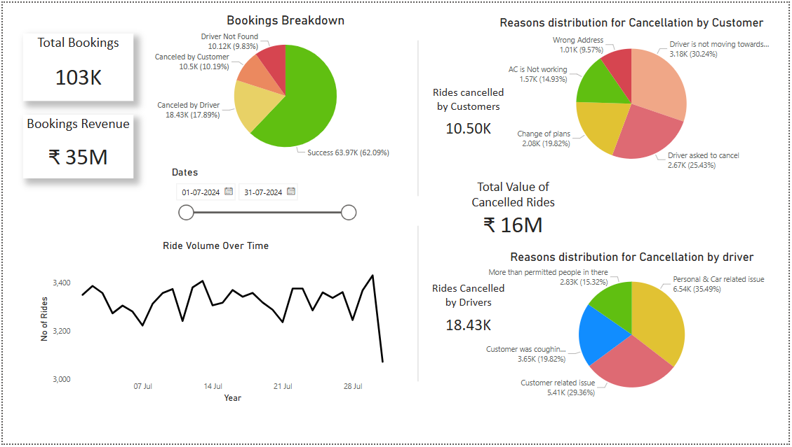
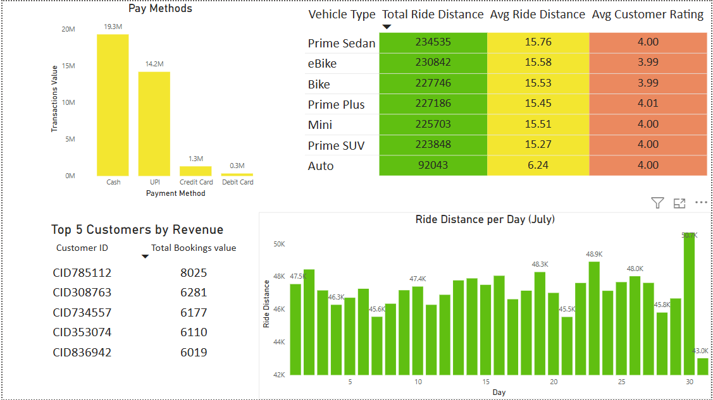

# 📊 Cab Booking Analytics Dashboard

## 📝 Overview  
This interactive Power BI dashboard analyzes one month of cab bookings, providing a comprehensive view of booking volumes, revenue, cancellations, payment methods, ride distances, and customer behavior. Built to help ride-hailing platforms identify key operational trends, user preferences, and potential inefficiencies, this dashboard supports data-driven decisions across business, customer service, and operations teams.

## 📂 Data Source  
The dataset comprises ride-level booking records for the month of July 2024. It includes details such as ride status, cancellation reasons, payment modes, customer ratings, vehicle types, and ride distances. Data preprocessing included:
- Cleaning null/missing values
- Standardizing date formats
- Mapping vehicle types and reasons for cancellation
- Calculating metrics like revenue, ride distance, and customer ratings using DAX

## 📈 Key Features  
- 🚖 **Bookings Breakdown** with Success vs Cancellation distribution  
- 💳 **Payment Method Analysis** by transaction value  
- 📉 **Cancellation Insights** categorized by customer and driver with root causes  
- 📆 **Daily Ride Volume & Distance Tracking**  
- 🚗 **Vehicle Type Performance** based on distance, ride length & rating  
- 🌟 **Top Customers by Revenue Contribution**  
- 📊 **Dynamic Time Slicer** for date filtering across visuals

## 🔍 Insights  
- Over **103K rides** were booked, generating **₹35M** in revenue for July 2024  
- **62% of rides were successful**, while **38% were cancelled**  
- Driver-related cancellations (18.4K) were more than customer ones (10.5K), with key issues including car condition, customer-related discomfort, or health concerns  
- Cash and UPI dominate payment methods, together accounting for over **₹33M in transactions**  
- **Prime Sedan** and **eBikes** contributed the highest ride distances, indicating strong demand for comfort and eco-friendly options  
- Average ride distances hover around **15.5 km**, except for Autos (6.2 km)  
- A few high-value customers alone contributed over **₹6K–₹8K each** in revenue  

## 🛠️ Tools Used  
- Power BI (for dashboard creation and DAX logic)  
- Excel (for raw data cleanup and transformation)

## 📸 Screenshots  
### Dashboard Overview  
  

## 💡 Learnings  
- Gained deeper experience with **DAX measures** for cancellation logic and conditional visuals  
- Strengthened ability to **design story-driven dashboards** for operations and customer analytics  
- Learned how to present complex multivariate insights (like cancellations and revenue) in an **intuitive, digestible format**  
- Enhanced proficiency in working with time-series data and customer segmentation within Power BI
